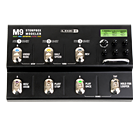
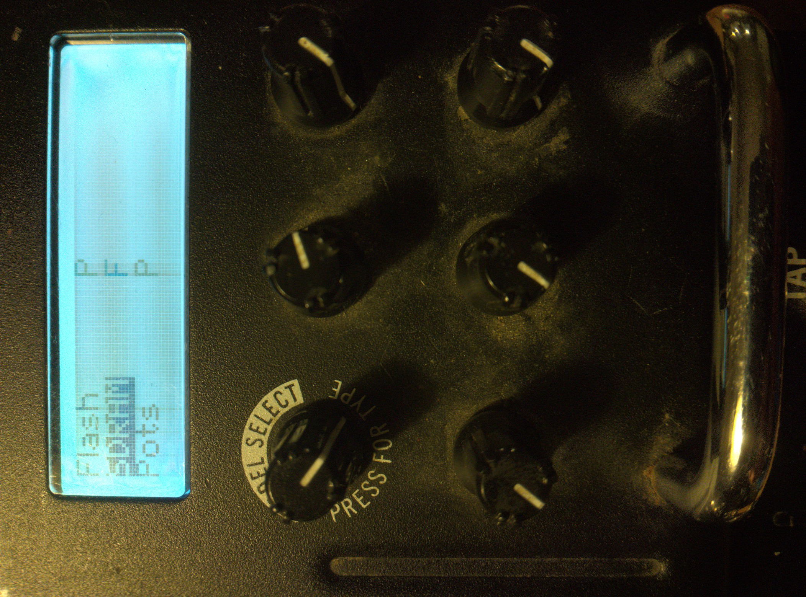
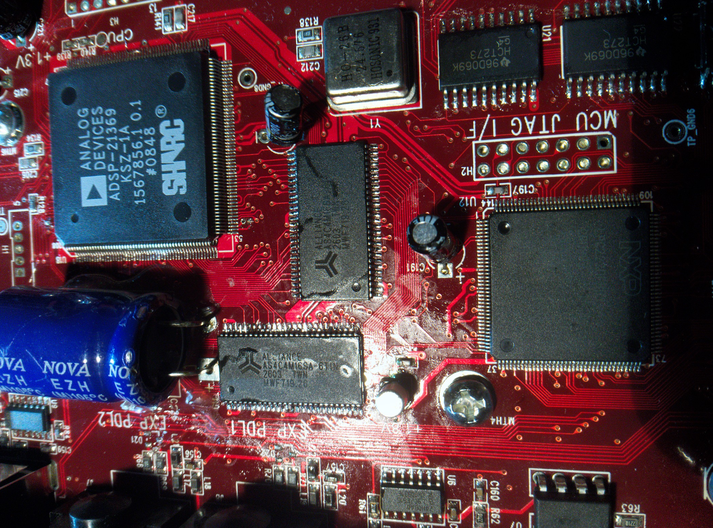

# Line 6 M9 SDRAM repair: dry signal but no effects or tuner

This repository documents the successful component-level repair of a **Line 6 M9 Stompbox Modeler** that passed clean audio in DSP Bypass but could not run effects or detect a signal in the tuner.

The M9's built-in production test reported an SDRAM failure. Replacing its two external SDRAM devices restored the tuner and effects. The production test then passed.

> [!WARNING]
> This is an unofficial repair procedure. It requires fine-pitch SMD rework and access to an undocumented production-test menu. A mistake can permanently damage the unit or corrupt calibration or configuration data. Do not run unfamiliar production-menu functions, and do not attempt the hardware repair without suitable equipment and experience.

## Contents

- [Symptoms](#symptoms)
- [Diagnosis](#diagnosis)
- [Entering the production-test menu](#entering-the-production-test-menu)
- [SDRAM test result](#sdram-test-result)
- [Replacement parts](#replacement-parts)
- [Repair procedure](#repair-procedure)
- [Result](#result)
- [Technical notes](#technical-notes)
- [References](#references)

## Symptoms

The M9 powered up normally, and its display and controls appeared to work. However:

- True Bypass worked.
- DSP Bypass passed a normal clean guitar signal.
- The tuner did not detect the guitar signal.
- The guitar effects did not process the signal.
- Selecting an effect sometimes caused approximately one second of silence, after which the clean signal returned.
- The tuner display could show `Mute` even though audio continued to pass until the setting was toggled.
- A factory reset and firmware 2.04 reinstallation did not solve the problem. **[Line 6 firmware update instructions](https://kb.line6.com/m5-m9-firmware-update-instructions)**

<!-- Replace the path below with your overview or symptom photograph. -->


## Diagnosis

Measurements around the Cirrus Logic CS42432 codec showed audio at its analogue inputs and outputs while DSP Bypass was active. This demonstrated that the ADC, basic digital-audio path and DAC were operational.

The digital section contains:

- Analog Devices `ADSP-21369` SHARC DSP
- NXP `LPC2220` system controller
- Two EtronTech `EM638165TS` external SDRAM devices
- SST/Microchip `SST39VF3201` parallel flash

The publicly available **Line 6 M13 service manual** was helpful because the M13 uses a closely related architecture containing the same LPC2220 controller, ADSP-21369 DSP and a pair of external SDRAMs. Its production-test documentation describes separate Flash and SDRAM tests.

Although the documentation is for the M13, the production-test SysEx command also worked on this M9.

## Entering the production-test menu

### Requirements

- A Windows computer
- A compatible USB-to-MIDI interface
- A MIDI cable connected from the interface's **MIDI OUT** to the M9's **MIDI IN**
- A SysEx transfer application
- [`line6-m9-enter-production-test.syx`](sysex/Line6_M9_Enter_Production_Test.syx)

### Install the MIDI application

<!-- Replace APP NAME and APP URL with the exact Microsoft Store application used. -->

1. Open the Microsoft Store.
2. Search for **`[APP NAME]`**.
3. Install it from **[Microsoft Store link](APP-URL)**.
4. Connect the USB-to-MIDI interface and allow Windows to finish installing it.

### Send the SysEx command

<!-- Adjust these steps to match the exact labels used by the selected application. -->

1. Connect the MIDI interface's output to the M9's MIDI input.
2. Switch on the M9 normally.
3. Open **`[APP NAME]`**.
4. Select the USB-to-MIDI interface as the MIDI output device.
5. Open or import [`line6-m9-enter-production-test.syx`](sysex/Line6_M9_Enter_Production_Test.syx).
6. Send the SysEx message.
7. Confirm that the M9 enters its production-test menu.

## SDRAM test result

All tested functions passed except SDRAM. The display reported:

```text
SDRAM F
```

Here, `F` indicated that the SDRAM production test had failed.



The result identifies a failure in the complete SDRAM subsystem. It does **not** identify which individual memory IC is defective. Possible causes include:

- A defective SDRAM device
- An open address, data or control connection
- A shorted bus signal
- A solder-joint or PCB-trace fault
- Missing or unstable 3.3 V supply
- A clock or SDRAM-controller problem

At first resoldering the SDRAM chips was tried out, but that did not solve the issue.


## Replacement parts

Two ×16 SDRAM devices operate together as the SHARC's 32-bit external-memory bank.

| Function | Original part | Replacement used |
|---|---|---|
| SDRAM, quantity 2 | EtronTech `EM638165TS-60` / `EM638165TS-6G` | Alliance Memory `AS4C4M16SA-6TIN` |
| Organisation | 4M × 16, 64 Mbit | 4M × 16, 64 Mbit |
| Supply | 3.3 V | 3.3 V |
| Speed | 166 MHz / 6 ns grade | 166 MHz / 6 ns grade |
| Package | 54-pin TSOP-II | 54-pin TSOP-II |

The replacement has the required organisation, voltage, speed and 54-pin TSOP-II pinout. Consult the manufacturers' complete datasheets before substituting components.

It was not established which of the two original EtronTech devices had failed. Both were replaced together.

<!-- REQUIRED: PCB overview with the two SDRAM locations marked. -->


<!-- Optional: close-up before replacement. -->


<!-- Optional: close-up after replacement. -->


## Repair procedure

The SDRAM devices are fine-pitch 54-pin TSOP-II packages. They have leads on two sides and **no exposed solder pad underneath**. Nevertheless, removal can require substantial controlled heating because the PCB and connected copper absorb heat.

A suitable procedure requires, at minimum:

- ESD precautions
- Temperature-controlled hot-air rework equipment
- Appropriate flux
- Fine solder and solder wick
- Magnification
- A multimeter with continuity/resistance measurement
- Careful protection of adjacent plastic parts and components

General sequence used:

1. Record the orientation of both original SDRAMs and locate pin 1.
2. Protect nearby heat-sensitive components appropriately.
3. Remove both original SDRAM devices using controlled preheating and hot air.
4. Clean and inspect every PCB pad.
5. Position both `AS4C4M16SA-6TIN` replacements with the correct orientation.
6. Solder all leads and inspect them under magnification.
7. With power disconnected, check for shorts between neighbouring pins.
8. Verify continuity of the supply, ground, address, data and control connections.
9. Power the M9 and rerun the SDRAM production test.

### Important lesson from this repair

Immediately after replacing the SDRAMs, the test still reported `SDRAM F`. Inspection and continuity testing found a solder bridge introduced during the replacement work.

After removing that bridge, the production test changed to `SDRAM P` and the M9 worked normally.

Therefore, a continued failure following replacement does not necessarily mean the replacement part is incompatible. Check every solder joint before replacing further components.

Particular attention should be paid to:

- `CLK`, `CKE` and `CS#`
- `RAS#`, `CAS#` and `WE#`
- Address and bank-address pins
- Every `DQ` data pin
- `LDQM` and `UDQM`, which should be tied low in this SHARC design
- All VDD/VDDQ and VSS/VSSQ pins
- Shorts between adjacent leads

## Result

After correcting the solder bridge:

- The production test reported `SDRAM P`.
- The tuner detected the guitar signal normally.
- Guitar effects processed the signal normally.
- The temporary silence and return to dry audio disappeared.
- DSP Bypass continued to operate normally.

<!-- REQUIRED or strongly recommended: photograph showing SDRAM P after repair. -->


The repair demonstrates that working DSP-bypass audio does not prove that all DSP-related hardware is healthy. The SHARC could execute the basic dry-audio path while failure of its external SDRAM prevented the tuner and effects engine from operating correctly.

## Technical notes

The production test proves that the SDRAM subsystem failed before the repair and passed afterward. Because both memory devices were changed simultaneously, it does not prove which individual original device was defective.

Another Line 6 M-series unit with similar symptoms could have a different cause. Run the diagnostic test and verify supplies, connections and bus signals before ordering components.

The same symptoms were previously reported for an M13—effects remained dry and changing effects caused about one second of silence—but no final repair was published. The successful M9 repair described here suggests SDRAM is worth testing in a similarly affected unit; it does not prove that every M9 or M13 with these symptoms has the same fault.

## Repository layout

```text
.
├── README.md
├── images
│   ├── m9-under-test.jpg
│   ├── production-test-menu.jpg
│   ├── sdram-test-fail.jpg
│   ├── sdram-test-pass.jpg
│   ├── m9-pcb-sdram-location.jpg
│   ├── original-etrontech-sdram.jpg
│   └── replacement-alliance-sdram.jpg
└── sysex
    └── line6-m9-enter-production-test.syx
```

Remove unused image entries and their corresponding Markdown references.

## References

- [Line 6 M13 service manual](https://www.synthxl.com/wp-content/uploads/2021/03/Line-6-M-13-Stompbox-Modeler-Service-Manual.pdf)
- [Analog Devices ADSP-21369 datasheet](https://www.analog.com/media/en/technical-documentation/data-sheets/ADSP-21369.pdf)
- [Analog Devices ADSP-2137x SHARC hardware reference](https://www.analog.com/media/en/dsp-documentation/processor-manuals/ADSP-2137x_hwr_rev2.2.pdf)
- [Alliance Memory AS4C4M16SA datasheet](https://www.alliancememory.com/wp-content/uploads/2025/03/Alliance_Memory_64M-AS4C4M16SA-CI_v5.0_October_2018.pdf)
- [EtronTech EM638165 SDRAM datasheet](https://etron.com/wp-content/uploads/2022/04/EM638165TSBM-Industrial_Rev-6.0.pdf)
- [Unresolved M13 report with similar symptoms](https://line6.com/support/topic/2608-m13-problem-is-my-unit-dead/)
- [Related M9 hardware-repair discussion](https://line6.com/support/topic/36647-m9-no-sound-hardware-repair-experience/)

## Contributing additional findings

If you encounter the same fault, useful information to include in an issue or discussion would be:

- Exact model and firmware version
- Production-test results
- Original SDRAM markings
- Replacement part number, if applicable
- Whether DSP Bypass passes audio
- Tuner behaviour
- What happens when an effect is selected
- Clear PCB and soldering photographs

This information may help establish whether SDRAM failure is a recurring fault across the Line 6 M-series.

